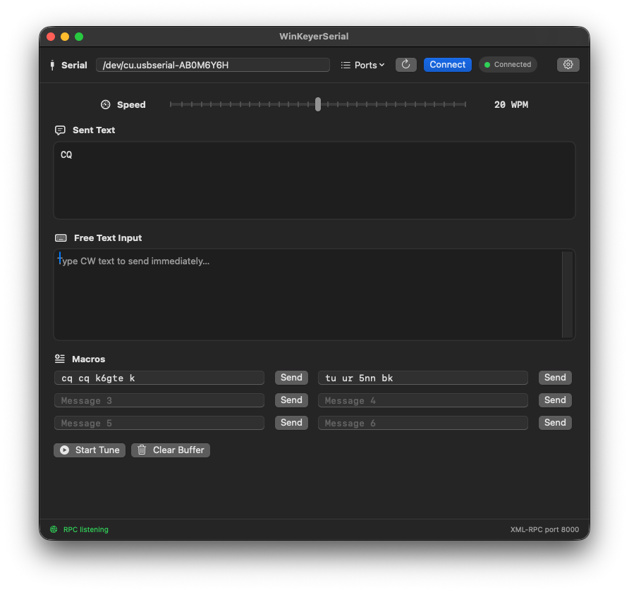

# SwiftKeyer

SwiftKeyer is a native macOS application for the K1EL WinKeyerSerial, WinKeyerUSB, and WKMini. It provides a SwiftUI interface for sending CW text, editing and sending macros, configuring paddle behavior, and controlling the keyer speed.

It's primary purpose, other than a stand alone interface to the winkeyer, is to act as a CW interface for the [not1mm](https://github.com/mbridak/not1mm) contest logger.

The application listens for XML-RPC requests on `127.0.0.1:8000`. The server is intentionally limited to the local machine so that the unauthenticated control API is not exposed to the network.


## Requirements

- macOS 14 or later
- Xcode with Swift 6 support
- A connected WinKeyer-compatible device
- A user-accessible serial device such as `/dev/cu.usbserial-*`

## Build and run in Xcode

Open `SwiftKeyer.xcodeproj`, select the `SwiftKeyer` scheme, and run. The project
contains four targets that mirror the Swift package layout:

- `SwiftKeyerApp` — the SwiftUI macOS application
- `SwiftKeyerCore` — serial transport, WinKeyer protocol, settings, and XML-RPC
- `CSerialShim` — the small Darwin `select` and `FIONREAD` shim
- `SwiftKeyerCoreTests` — protocol, settings, and XML-RPC tests

The app target is configured to **Sign to Run Locally**, so it builds and runs
without a development team. To distribute the app, set your team under Signing &
 Capabilities and enable Hardened Runtime.

Sources are referenced directly from `Sources` and `Tests`, so there is no
duplicated copy of the code in the project.

## Build and run from the command line

The Swift package is still the supported command-line build:

```bash
swift build
swift test
swift run SwiftKeyer
```

The executable can also be opened directly after building:

```bash
open .build/debug/SwiftKeyer
```

To create a release build:

```bash
swift build -c release
```

The same operations run through `xcodebuild`:

```bash
xcodebuild -project SwiftKeyer.xcodeproj -scheme SwiftKeyer build
xcodebuild -project SwiftKeyer.xcodeproj -scheme SwiftKeyer test
```

## Serial connection

Connect the WinKeyer before starting the application. If exactly one serial device is available, it is selected automatically. The device path can also be chosen from the serial-device menu or entered directly.

The keyer uses 1200 baud, 8 data bits, no parity, and 2 stop bits. The application monitors speed-pot changes and sends a status request periodically.

## Settings

The first launch creates `~/.pywinkeyer.json`. The file remains compatible with the original Python application and stores:

- The selected serial device
- Six saved macros
- The paddle mode register

Edits to macros, the device path, or paddle settings are saved automatically. The keyer settings sheet maps directly to the WinKeyer mode-register bits.

## XML-RPC API

The server accepts standard XML-RPC `POST` requests at `/RPC2` and `/`. The supported methods are:

- `k1elsendstring(text)`
- `setspeed(wordsPerMinute)`
- `sendblended(text)`
- `tuneon()`
- `tuneoff()`
- `clearbuffer()`
- `system.listMethods()`
- `system.methodHelp(method)`
- `system.methodSignature(method)`

For example:

```python
import xmlrpc.client

server = xmlrpc.client.ServerProxy("http://127.0.0.1:8000")
server.k1elsendstring("CQ TEST")
```

The RPC API has no authentication. Keep the server bound to loopback and do not expose port 8000 through a firewall or port forward.

## Project layout

- `Sources/SwiftKeyerCore` contains the serial transport, WinKeyer protocol, settings, controller, and XML-RPC implementation.
- `Sources/SwiftKeyerApp` contains the SwiftUI application and app lifecycle.
- `Sources/CSerialShim` contains the small Darwin `select` and `FIONREAD` shim used by the serial port, along with the module map that exposes it to Swift.
- `Tests/SwiftKeyerCoreTests` contains protocol, settings, and XML-RPC tests.
- `SwiftKeyer.xcodeproj` is the Xcode project; it references the directories above in place rather than duplicating them.

The application is implemented entirely in Swift and does not require a Python runtime.
